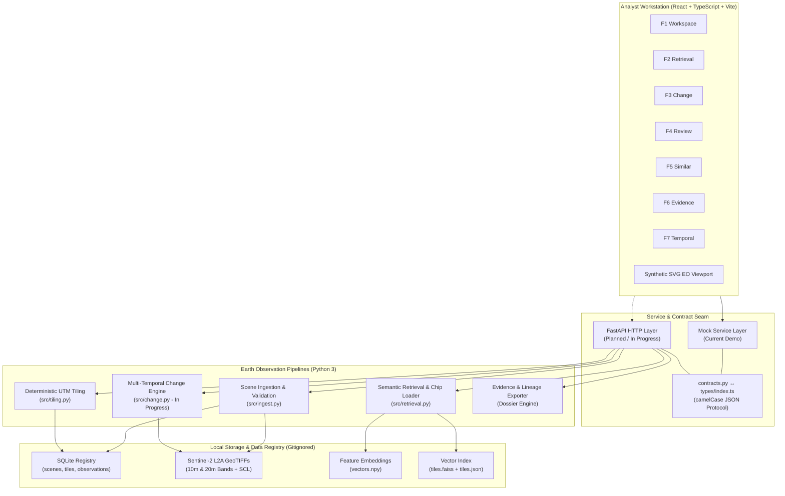

# GeoSentinel

**Semantic Retrieval and Multi-Temporal Change Analysis of Satellite Imagery**

GeoSentinel is an Earth Observation (EO) intelligence platform engineered to make satellite imagery searchable through natural language and to detect, quantify, and audit physical land-cover changes across multi-temporal acquisition sequences.

---

## 🚀 Live Demo

**Public Workstation:** [https://geosentinel-neon.vercel.app/](https://geosentinel-neon.vercel.app/)

> **Notice:** The public deployment is a **frontend-only demonstration** running against a realistic local mock service layer. It enables analysts, evaluators, and reviewers to interact with the complete F1–F7 workflow, inspect spectral metrics, and evaluate workstation ergonomics without requiring local GPU infrastructure, multi-gigabyte raster downloads, or an active backend server. Real semantic retrieval embeddings and automated change detection pipelines are currently in active backend development.

---

## Project Status

| Milestone / Component | Status | Details |
|---|---|---|
| **Analyst Workstation UI (F1–F7)** | **Complete** | All 7 dedicated analyst modules implemented, interactive, and styled |
| **Production Frontend Build** | **Verified** | Strict TypeScript check (`tsc --noEmit`) and production bundle verified |
| **Public Deployment** | **Live** | Continuous deployment active on Vercel |
| **Scene Ingestion & Validation** | **Implemented** | Sentinel-2 L2A GeoTIFF validation, SCL policy screening, SHA-256 asset fingerprinting |
| **Deterministic AOI Tiling** | **Implemented** | Metric 2560 m × 2560 m grid generation in native UTM coordinates |
| **Phase 1 Data Foundation** | **Passed** | Automated registry, tile stability, and window recipe checks validated |
| **Semantic Retrieval Backend** | **In Progress** | `RasterChipLoader` and candidate filtering implemented; embedding generation & FAISS index building in progress |
| **Multi-Temporal Change Backend** | **In Progress** | Spectral math and quality check architecture established; execution pipeline in progress (`change.py`) |
| **Backend REST API & Integration** | **Planned / In Progress** | FastAPI endpoints and frontend live HTTP service layer scheduled for Phase 4 |

---

## What is GeoSentinel?

Modern Earth Observation satellites produce terabytes of imagery daily, but extracting actionable intelligence remains labor-intensive. Analysts must manually identify cloud-free scenes, select spectral band combinations, and perform visual comparisons across massive spatial footprints.

GeoSentinel addresses this operational bottleneck by treating spatial tiles as unified atoms of semantic search and temporal reasoning:

- **Semantic Satellite-Image Retrieval:** Enables analysts to search satellite catalogs using natural-language descriptions (e.g., *"reservoir with receding water line"*, *"vegetation clearing near river bend"*) or visual reference tiles rather than manual metadata filtering.
- **Multi-Temporal Change Analysis:** Quantifies physical land-cover shifts between baseline and comparison dates using surface reflectance ratios (NDWI, NDVI, NDBI) paired with rigorous atmospheric masking.
- **Spatial Investigation:** Divides massive $100\text{ km} \times 100\text{ km}$ Sentinel-2 granules into uniform, geographically anchored $2560\text{ m} \times 2560\text{ m}$ metric tiles to preserve localized features that would otherwise be lost in scene-level averages.
- **Analyst Review:** Provides a human-in-the-loop adjudication console where analysts inspect automated detections, evaluate quality gates, and record durable operational dispositions (`confirmed`, `rejected`, `flagged`).
- **Evidence and Provenance:** Generates verifiable, audit-ready dossiers containing complete data lineage, sensor metadata, processing parameters, and event logs.
- **Temporal Analysis:** Evaluates multi-date observation stacks to track trajectory curves, compute interval rates of change, and establish the **Earliest Supported Observation** of an evolving physical event.

GeoSentinel is engineered for intelligence analysts, disaster relief coordinators, environmental monitors, and municipal infrastructure planners.

---

## Analyst Workflow

The workstation provides a cohesive, end-to-end mission workflow across seven dedicated operational stations (accessible via sidebar or keyboard shortcuts **F1–F7**):

```text
[F1] Overview ──> [F2] Semantic Retrieval ──> [F5] Similar Sites
                         │
                         ▼
               [F3] Change Analysis
                         │
                         ▼
               [F7] Temporal Analysis
                         │
                         ▼
               [F4] Analyst Review
                         │
                         ▼
             [F6] Evidence & Provenance
```

1. **F1 — Workspace / Overview:** High-level mission cockpit displaying active Area of Interest (AOI) boundaries, registered scene catalogs, orbital parameters, and sensor telemetry.
2. **F2 — Semantic Retrieval:** Natural language and visual query console with interactive ranking, similarity thresholds, and atmospheric filters. Analysts can stage identified candidate tiles directly into Change Analysis.
3. **F3 — Change Analysis:** Bi-temporal comparative console pairing baseline ($T_1$) and comparison ($T_2$) acquisitions, displaying spectral index deltas (NDWI, NDVI, built-up) and evaluating 14 automated quality checks.
4. **F4 — Analyst Review:** Human-in-the-loop decision station to adjudicate candidate detections, inspect verification checklists, log rationale, and sign off on findings.
5. **F5 — Similar Site Discovery:** Cross-catalog analog search engine matching land-cover signatures across distant geographic catchments.
6. **F6 — Evidence & Provenance:** Audit workstation tracking end-to-end data lineage, sensor calibration levels, processing histories, and machine-readable JSON/Markdown dossier export.
7. **F7 — Multi-Temporal Analysis:** Longitudinal investigation console tracing multi-date progression curves, interval expansion rates, hydrological phases, and the earliest supported observation date.

*Note: The frontend currently operates against typed mock services, enabling complete workflow evaluation without backend coupling.*

---

## Frontend

The frontend is built from the ground up as a specialized command-and-control interface for Earth Observation professionals, deliberately avoiding generic consumer SaaS dashboard conventions.

- **Stack:** React 18, TypeScript (`strict: true`), Vite (port 3000), Tailwind CSS / custom GIS design system, and Lucide icons.
- **Visual Identity:** Low-light, high-contrast tactical dark theme (`#0B0F17` background, slate paneling, emerald status indicators, and amber alert badges) tailored for extended analyst shifts.
- **Synthetic Viewport (`ImageryViewport.tsx`):** A custom interactive SVG Earth Observation canvas supporting multiple spectral visualizations (True Color RGB, False Color Infrared, NDVI, and Change Heatmaps) with pan, zoom, scale bar, and real-time MGRS/geographic coordinate readouts.
- **Mock Service Abstraction:** Clean service boundaries (`retrievalService`, `changeAnalysisService`, `reviewService`, etc.) simulate realistic network latencies and return contract-compliant data shapes, providing a seamless drop-in seam for future REST API clients.

---

## Backend

The backend provides deterministic data pipelines, spatial indexing, and analytical processing implemented in Python 3.

### Implemented Foundations
- **Scene Ingestion & Validation (`backend/src/ingest.py`):** Ingests Sentinel-2 L2A GeoTIFFs, verifies spatial overlap against AOI boundaries, validates 10m vs. 20m band resolutions, calculates SHA-256 asset fingerprints, and registers products in SQLite.
- **Authoritative SCL Quality Policy:** Strictly defines clear surface observation percentages using Sen2Cor Scene Classification Layer (SCL) classes 4 (vegetation), 5 (bare soil), and 6 (water), while screening cloud classes (8, 9, 10) and cloud shadow (3).
- **Deterministic AOI Tiling (`backend/src/tiling.py`):** Partitions AOI envelopes into fixed $2560\text{ m} \times 2560\text{ m}$ UTM metric tiles anchored to the AOI top-left in native projected coordinates (EPSG:32643 for pilot). Generates stable tile IDs (`{mgrs}_r{row}_c{col}`) across all dates.
- **Per-Band Chip Window Recipes:** Generates pixel window offsets (`row_off`, `col_off`, `height`, `width`) for 10m ($256 \times 256$) and 20m ($128 \times 128$) bands and validates raster metadata using Rasterio without reading pixel data into memory.
- **Raster Chip Loading (`backend/src/retrieval.py`):** Extracts natural-color RGB windows (B04, B03, B02) and applies robust 2nd/98th percentile normalization to output float32 arrays in $[0.0, 1.0]$.
- **Data Contracts (`backend/contracts.py`):** Canonical Python dataclasses (`Scene`, `Tile`, `SearchQuery`, `SearchResult`, `ChangeResult`, `QualityChecks`, `ReviewDecision`) featuring automated snake_case to camelCase JSON serialization via `to_json()`.

### Planned / In-Progress Components
- **Semantic Embeddings:** Vision-language dual-encoder inference (OpenCLIP `ViT-B-32` / SigLIP) to project tile chips and textual queries into a shared embedding space.
- **Vector Similarity Index:** Persistent FAISS `IndexFlatIP` search index mapping embedding vectors to tile observations.
- **Multi-Temporal Change Engine (`backend/src/change.py`):** Bi-temporal pixel differencing, spectral index ratios (NDVI, NDWI, NDBI), valid pixel masking, and automated confidence scoring.
- **False-Alarm Suppression:** Multi-temporal consistency checks to filter out ephemeral surface noise and agricultural crop cycles.
- **REST API:** FastAPI application exposing `/scenes`, `/search`, `/change`, `/reviews`, and `/evidence` endpoints.

---

## Architecture



---

## Canonical Pune Demonstration

The frontend includes a canonical pilot demonstration dataset focused on the Pune Metropolitan Basin to validate workstation interactions, visual hierarchy, and handoff flows:

- **Investigation ID:** `INV-2025-PUNE-001`
- **Area of Interest (AOI):** `AOI-MAHARASHTRA-PUNE-METRO`
- **Region / Basin:** Pune Metropolitan Basin & Khadakwasla Watershed
- **MGRS Tile:** `43QDF`
- **Native Projected CRS:** `EPSG:32643` (UTM Zone 43N)
- **Centroid:** `18.5204° N, 73.8567° E`
- **Primary Feature:** Khadakwasla Reservoir Basin
- **Observation Stack:** May 2025 (Pre-monsoon baseline, $11.20\text{ km}^2$ water extent) through September 2025 (Post-monsoon peak, $28.45\text{ km}^2$ water extent) tracing a $+17.25\text{ km}^2$ ($+154.0\%$) expansion over 129 days.

> **Verification Notice:** The measurements, spectral metrics, and narrative timeline in the Pune demonstration represent **curated demonstration and mock values** designed to illustrate the end-to-end analyst experience. They must not be cited as real-time, scientifically validated satellite observations until produced by the live backend pipeline.

---

## Project Structure

```text
geosentinel/
├── frontend/          # Analyst-facing React/Vite workstation
├── backend/           # EO pipelines, contracts and planned API
├── docs/              # Product and engineering documentation
├── models/            # Retrieval/change-analysis model artifacts
└── data/              # Local imagery, registry and indexes (gitignored)
```

---

## Documentation

The repository includes comprehensive engineering documentation located in [`docs/`](./docs/):

| Document | Purpose |
|---|---|
| [**docs/PROJECT_GUIDE.md**](./docs/PROJECT_GUIDE.md) | Master developer onboarding guide, architectural walkthrough, runbooks, and glossary |
| [**docs/prd.md**](./docs/prd.md) | Product requirements document detailing analyst personas, requirements, and acceptance criteria |
| [**docs/architecture.md**](./docs/architecture.md) | Detailed technical architecture, component responsibilities, and system design |
| [**docs/integration.md**](./docs/integration.md) | Integration contracts, data layouts, environment configurations, and runbooks |
| [**docs/phases.md**](./docs/phases.md) | Phased project delivery plan outlining milestones from Phase 0 to Phase 6 |
| [**docs/rules.md**](./docs/rules.md) | Normative engineering rules, spatial constraints, and architectural decision records |

---

## Local Development

### 1. Frontend Workstation

```bash
cd frontend

# Install dependencies
npm install

# Start Vite local development server
npm run dev

# Verification checks
npm run typecheck
npm run build
```

The workstation will be accessible at `http://localhost:3000`.

### 2. Backend Environment

```bash
cd backend

# Create and activate Python virtual environment
python -m venv .venv
source .venv/bin/activate  # macOS / Linux
# .\.venv\Scripts\Activate.ps1  # Windows PowerShell

# Install active dependencies
pip install -r requirements.txt
```

### 3. Pipeline Ingestion & Validation

```bash
# Inspect ingestion CLI
python -m src.ingest --help

# Inspect tiling CLI
python -m src.tiling --help

# Run deterministic retrieval chip loader validation test
python -m src.retrieval --test-loader

# Inspect retrieval CLI
python -m src.retrieval --help
```

---

## Team Modules

GeoSentinel is organized across three primary collaborative workstreams:

1. **Frontend / Analyst Workstation:** User interface design, state transitions, interactive map viewport, mock service fidelity, and HTTP client integration.
2. **Semantic Retrieval:** Vision-language dual-encoder modeling (OpenCLIP), tile chip preprocessing, vector index construction (FAISS), similarity ranking, and Recall@K evaluation.
3. **Change Analysis:** Spectral mathematics, SCL atmospheric masking, false-alarm suppression, quality gate checks, temporal trajectory curve fitting, and evidence compilation.

---

## Development Principles

- **Contracts First:** Data structures are defined in `contracts.py` and synced with `types/index.ts` before writing UI or pipeline logic.
- **Tiles as Retrieval Atoms:** Search and change algorithms operate on fixed 2560m metric ground squares rather than unwieldy full scenes.
- **Deterministic Processing:** Given the same inputs, ingestion, tiling, and quality checks yield identical outputs across environments.
- **Quality-First Analysis:** Never emit an automated change detection score without attaching comprehensive atmospheric and co-registration quality checks.
- **Mocks Remain Supported:** The offline mock mode must always remain functional to allow frontend development and demonstrations without backend dependencies.
- **Large Satellite Data Stays Local:** Multi-gigabyte rasters, embedding matrices, and vector indexes remain strictly local and gitignored.
- **Reproducible Experiments:** Evaluations and training pipelines rely on versioned registries and fixed coordinate projections.
- **Focused Commits:** Code changes remain scoped to single modules with passing tests and verified TypeScript builds.

---

## Roadmap

- **Phase 1 — Data Foundation (Complete):** L2A scene ingestion, AOI boundary validation, deterministic 2560m UTM tiling, tile observation registry, and window recipe generation.
- **Phase 2 — Semantic Retrieval (In Progress):** Raster chip extraction, multimodal embedding generation (OpenCLIP), FAISS vector indexing, ranked retrieval CLI, and Recall@K benchmarking.
- **Phase 3 — Multi-Temporal Change (In Progress):** Temporal scene pairing, SCL valid-pixel masking, spectral delta computation (NDWI/NDVI/NDBI), automated quality checks, and temporal evolution analysis.
- **Phase 4 — Integration & API (Planned):** FastAPI backend service, live frontend service integration (`VITE_USE_MOCKS=false`), durable review persistence, and dynamic evidence dossier generation.

---

## Repository & Data Rules

Due to the massive footprint of Earth Observation imagery, strict repository hygiene rules are enforced:

- **Never Commit Raw Rasters or Indexes:** Imagery folders, GeoTIFFs (`*.tif`, `*.tiff`), JP2 files, embedding arrays (`*.npy`), and vector indexes (`*.faiss`) are blocked via `.gitignore`.
- **Never Commit Database Binaries or Logs:** SQLite files (`*.sqlite`) and local log outputs remain local.
- **Never Commit Secrets:** API keys and environment files (`.env`) must never be pushed to version control (`frontend/.env.example` serves as the tracked template).

---

## Git Workflow

Before staging or committing any code:

```bash
# Check working tree status
git status

# Ensure no trailing whitespace or merge conflict markers
git diff --check

# Review summary of modified files
git diff --stat
```

Always ensure `npm run typecheck` passes cleanly before submitting a Pull Request.

---

## Final Notes

GeoSentinel is an applied research and engineering project exploring modern satellite imagery intelligence, vision-language retrieval models, and analyst-centered geospatial workflows. Built for high performance, auditability, and clarity, it bridges the gap between raw Earth Observation data and actionable geographic decisions.
